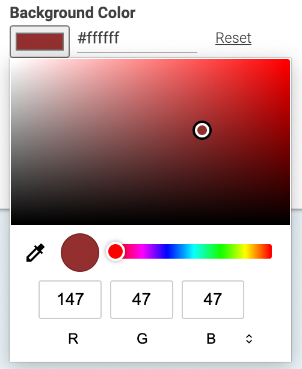

# Color Picker

Just a little Studio extension that allows users to pick and set colors within Studio

### Examples




### Installation

- From the project's root folder, clone this repository as a submodule of the extensions folder. Make sure to use the branch name that matches your workspace version. 
```
git submodule add https://github.com/coremedia-contributions/color-picker modules/extensions/color-picker
```

- Use the extension tool in the root folder of the project to link the modules to your workspace.
 ```
mvn -f workspace-configuration/extensions com.coremedia.maven:extensions-maven-plugin:LATEST:sync -Denable=color-picker
```

### How to use
Add a dependency to
```
"@coremedia-labs/studio-client.ext.color-picker-studio-client": "1.0.0-SNAPSHOT",
```
to your package.json file

Import 

```
import ColorPickerPropertyField from "@coremedia-labs/studio-client.ext.color-picker-studio-client/components/ColorPickerPropertyField";
```

Use it 
```
Config(ColorPickerPropertyField, {
  propertyName: "localSettings.textColor",
  initialColor: "#000000",
})
```
